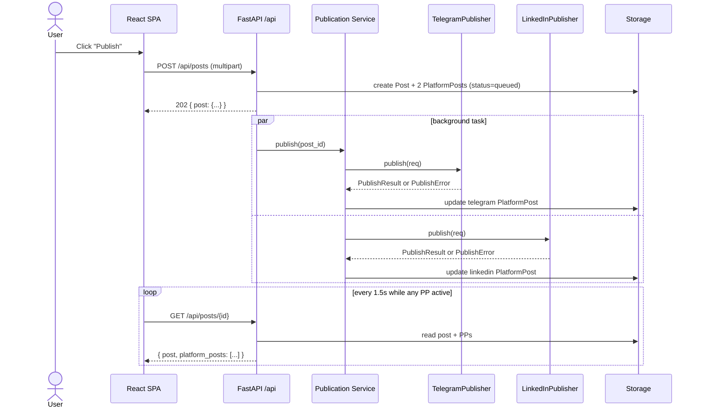
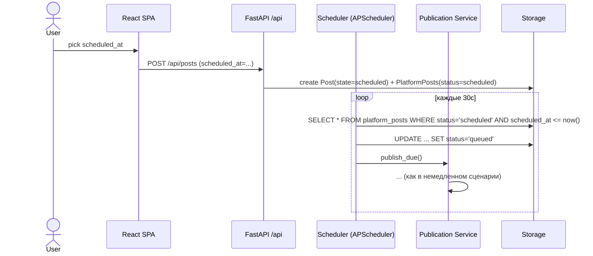

# onepost — Архитектура MVP

Кросс-постинг в LinkedIn (личный профиль) и Telegram-канал из единой точки.
Однопользовательский MVP. Локальный запуск сейчас, прицел на VPS в будущем.

## 1. Цели и нецели

**В скоупе MVP**
- Один пользователь (владелец).
- Пост = текст + опционально 1 изображение.
- Общий текст с возможностью per-platform override.
- Публикация «сейчас» и по расписанию (`scheduled_at`).
- Best-effort публикация на каждую платформу + автоматические ретраи с экспоненциальным backoff для транзиентных ошибок.
- Локальный запуск на macOS, OAuth через loopback на `127.0.0.1`.

**Вне скоупа MVP** (см. §11)
- Мультиюзерность, биллинг, команды, роли.
- Аналитика, метрики вовлечённости, ответы/комментарии.
- Все платформы кроме LinkedIn personal profile и Telegram channel.
- Видео, PDF-карусели, опросы.
- Полноценный деплой на VPS с CI/CD (архитектура его учитывает, но шаги — это уже после MVP).
- Откат публикации (rollback при частичном падении) — слишком хрупко.

## 2. Выбор стека

### Решение: Python 3.11+ / FastAPI (JSON API) + React 18 / Vite / TypeScript / Tailwind + shadcn/ui

| Слой | Выбор | Почему |
|---|---|---|
| Язык бэка | Python 3.11+ | Предпочтение пользователя; зрелые HTTP-клиенты; быстрый прототип. |
| Backend | FastAPI (JSON API) | Минимум boilerplate, async-готов для httpx, Pydantic-валидация. Отдаёт только JSON; HTML не рендерит. |
| Frontend | React 18 + Vite + TypeScript | SPA-однуэкранник в `frontend/`. См. §2.1. |
| UI-kit | Tailwind CSS + shadcn/ui + lucide-react | Минимализм, dark/light темы из коробки. |
| ORM / миграции | SQLAlchemy 2.x + Alembic | Стандарт; даёт возможность безболезненно перейти SQLite → Postgres при переезде на VPS. |
| БД | SQLite (файл) | Один пользователь, локально. Схема пишется так, чтобы быть совместимой с Postgres. |
| HTTP-клиент | httpx (async) | Параллельные вызовы LinkedIn/Telegram, тайм-ауты, ретраи. |
| Шифрование токенов | `cryptography` Fernet | Симметричное шифрование, ключ из `.env`. |
| Планировщик | APScheduler (in-process) | Один процесс, без Redis. Абстрагирован за интерфейс, чтобы заменить на Celery/RQ при переезде. |
| Конфиг | pydantic-settings + `.env` | Типизированная конфигурация. |
| Тесты | pytest + httpx MockTransport | Юнит и интеграционные тесты против фейковых LinkedIn/Telegram. |
| Линт/формат | ruff + mypy | Один тул для линта и формата + строгая типизация в core-слоях. |

### 2.1 Frontend подробнее

Frontend — отдельный SPA в `frontend/`, использует JSON API бэкенда. Monorepo: один git-репозиторий, два независимых проекта рядом.

- **Vite + React 18 + TypeScript** — dev-сервер на `:5173`, `vite.config.ts` проксирует `/api/*` → `http://127.0.0.1:8000`. Прод-сборка кладёт статику в `frontend/dist`, FastAPI её отдаёт (StaticFiles + SPA fallback).
- **Tailwind CSS + shadcn/ui** — компоненты `Button`, `Textarea`, `Switch`, `Card`, `Sheet`, `Dialog`, `Toast`, `Skeleton`. Темы: light + dark через `class="dark"` на `<html>`.
- **lucide-react** — иконки.
- **State** — `useState` на уровне экрана; глобальный store не нужен (один экран). Mock-API в `src/lib/api.ts` совпадает по типам с реальным JSON, чтобы замена `fetch` → real была заменой одной строки на функцию.

**Структура `frontend/`:**
```
frontend/
├── package.json
├── vite.config.ts
├── tsconfig.json
├── tailwind.config.ts
├── postcss.config.cjs
├── index.html
├── components.json              # shadcn config
└── src/
    ├── main.tsx
    ├── App.tsx                  # один экран, композирует всё
    ├── index.css                # tailwind directives + темы
    ├── lib/
    │   ├── api.ts               # реальные вызовы JSON-эндпоинтов
    │   ├── mockApi.ts           # моки для dev до подключения бэка
    │   └── types.ts             # Post, PlatformPost, Status, Platform
    └── components/
        ├── ui/                  # сгенерированные shadcn-компоненты
        ├── PostComposer.tsx
        ├── PlatformToggle.tsx
        ├── PostPreview.tsx      # LinkedIn + Telegram карточки
        ├── PublishStatus.tsx    # статусы публикации с retry
        ├── OverridesAccordion.tsx
        ├── ScheduleSheet.tsx
        ├── ConnectionsCard.tsx  # LinkedIn OAuth / Telegram-handle
        └── History.tsx          # последние посты со статусами
```

**Почему не HTMX (раньше было выбрано HTMX, развернулись на React):**
- В compose-форме хватает локального React-state, чтобы делать живой preview и счётчик символов без round-trip — на HTMX это unnecessary trip.
- shadcn/ui даёт готовую тёмную тему и аккуратные компоненты, под HTMX пришлось бы писать руками.
- Per-platform overrides + schedule sheet + history — несколько связанных состояний, на React они композируются естественнее, чем серверные partials.
- Цена: отдельная сборка, npm, ~30 МБ node_modules. Для MVP принято.

### Альтернативы, которые рассматривались

- **Node/TypeScript (NestJS / Fastify)** — плюс: один язык на фронте и бэке если когда-нибудь будет SPA. Минус: пользователь предпочитает Python; для MVP меньше выигрыша.
- **Go (chi / echo)** — плюс: быстрый бинарь, дешёвый деплой. Минус: больше boilerplate для HTTP/JSON-структур LinkedIn, дольше прототипировать.
- **Django** — плюс: батарейки (admin, миграции, auth). Минус: тяжёлый под одного пользователя, async-стек у LinkedIn/Telegram идиоматичнее на FastAPI.
- **Flask** — плюс: проще FastAPI. Минус: нет встроенной валидации, async — через костыли.
- **HTMX vs React/SPA** — изначально выбрали HTMX («один экран, нет npm»), реализовали и работало. Развернулись на React: shadcn/ui экономит много времени на dark mode + accessibility, а композиция overrides/schedule/history оказалась чище в React-компонентах, чем в Jinja-partials.
- **APScheduler vs Celery+Redis vs cron** — для MVP нужна ровно одна задача с `scheduled_at`. APScheduler в том же процессе достаточно; Celery — лишняя инфраструктура; cron — менее гибко и плохо переживает миграцию состояния.

## 3. Компоненты системы

```
   ┌──────────────────────────┐
   │   React SPA (frontend/)  │   dev: vite :5173 → proxy /api
   │   Vite + TS + shadcn/ui  │   prod: served as static from FastAPI
   └────────────┬─────────────┘
                │ fetch /api/*
                ▼
┌─────────────────────────────────────────────────────────────────┐
│                        FastAPI process                          │
│                                                                 │
│  ┌──────────────┐    ┌──────────────────┐    ┌──────────────┐   │
│  │  API layer   │───▶│  Publication     │───▶│  Publisher   │   │
│  │  (JSON only) │    │  Service         │    │  Registry    │   │
│  │              │    │  (orchestrator)  │    │              │   │
│  └──────────────┘    └────────┬─────────┘    └──────┬───────┘   │
│         │                     │                     │           │
│         │                     ▼                     ▼           │
│         │            ┌──────────────────┐  ┌────────────────┐   │
│         │            │  Scheduler       │  │ TelegramPub.   │   │
│         │            │  (APScheduler)   │  │ LinkedInPub.   │   │
│         │            └──────────────────┘  └────────┬───────┘   │
│         │                     │                     │           │
│         ▼                     ▼                     │           │
│  ┌──────────────────────────────────────┐           │           │
│  │  Storage layer                       │           │           │
│  │  ┌─────────┐ ┌──────────┐ ┌────────┐ │           │           │
│  │  │ Posts   │ │ Platform │ │ Tokens │ │◀──────────┘           │
│  │  │         │ │ Posts    │ │ (enc.) │ │                       │
│  │  └─────────┘ └──────────┘ └────────┘ │                       │
│  │            ┌────────────┐            │                       │
│  │            │ MediaStore │            │                       │
│  │            │ (FS)       │            │                       │
│  │            └────────────┘            │                       │
│  └──────────────────────────────────────┘                       │
└─────────────────────────────────────────────────────────────────┘
                              │ httpx
                              ▼
              ┌───────────────────────────────┐
              │  LinkedIn API   │  Telegram   │
              │  /rest/posts    │  Bot API    │
              └───────────────────────────────┘
```

### 3.1 API layer (`app/api`)
- Только JSON-эндпоинты под префиксом `/api`. Никакого Jinja / HTML.
- Pydantic-схемы для request/response в `app/api/schemas.py`.
- Эндпоинты MVP:
  - `POST /api/posts` (multipart: text, image?, scheduled_at?, overrides?, platforms[]) → создаёт Post + PlatformPosts, запускает публикацию.
  - `GET /api/posts` → список последних 50 постов с их PP.
  - `GET /api/posts/{id}` → один пост + PP.
  - `POST /api/posts/{id}/retry/{platform}` → пере-запустить публикацию для одной платформы.
  - `DELETE /api/posts/{id}` → отменить scheduled-пост (если ещё не ушёл).
  - `GET /api/connections` → статус LinkedIn (connected/not) и Telegram (валиден ли токен).
  - `GET /api/oauth/linkedin/start` → URL для редиректа в LinkedIn.
  - `GET /api/oauth/linkedin/callback` → обмен code, сохранение токенов, редирект на frontend.
- CORS в dev: разрешён `http://localhost:5173`. В проде frontend подаётся тем же FastAPI — CORS не нужен.
- В MVP — никакой auth: слушает только `127.0.0.1`. При переезде на VPS — basic auth / cookie session (см. §11).
- Прод-режим: FastAPI монтирует `frontend/dist` как статику с SPA-fallback (любой не-`/api` путь → `index.html`).

### 3.2 Publication Service (`app/services/publication.py`)
- Оркестратор. Принимает `Post`, разворачивает в N `PlatformPost` (по одной на платформу), вызывает соответствующие `Publisher`-ы параллельно через `asyncio.gather(return_exceptions=True)`.
- Не знает о конкретных платформах — только об интерфейсе `Publisher`.
- Записывает статусы и `external_id` в БД. Падение одной платформы не отменяет другую.

### 3.3 Publisher Registry + платформенные реализации (`app/publishers/`)
- `Publisher` — protocol (см. §4).
- Реализации: `TelegramPublisher`, `LinkedInPublisher`.
- Registry — простой dict `{platform_id: Publisher}`. Добавление новой платформы = одна реализация + регистрация.

### 3.4 Auth / Token layer (`app/auth/`)
- `LinkedInOAuth`: запуск flow, callback, обмен code→token, refresh-сценарий.
- `TokenStore`: чтение/запись зашифрованных токенов в БД.
- Refresh: проверка `expires_at` перед каждым вызовом; если осталось <7 дней — refresh; если refresh-токен мёртв — UI показывает баннер «требуется реавторизация».
- Telegram — просто bot token + chat_id в `.env`/конфиге; не требует refresh.

### 3.5 Storage layer (`app/storage/`)
- SQLAlchemy-модели + Alembic.
- `MediaStorage` — тонкий интерфейс с одной реализацией `LocalMediaStorage` (запись в `data/media/<uuid>.<ext>`). Абстракция позволяет позже подключить S3/MinIO без изменений в publication service.

### 3.6 Scheduler (`app/scheduler/`)
- APScheduler `AsyncIOScheduler`, поднимается в lifespan FastAPI.
- Один периодический job (раз в 30с): «забрать `PlatformPost`-ы с `status='scheduled'` и `scheduled_at <= now`, перевести в `queued`, вызвать publication service».
- Также используется для backoff-ретраев (см. §8).

## 4. Абстракция платформы

```python
# app/publishers/base.py
from typing import Protocol
from dataclasses import dataclass

@dataclass
class PublishRequest:
    text: str
    image_path: str | None        # абсолютный путь на локальный файл, или None
    idempotency_key: str          # для дедупликации при ретраях

@dataclass
class PublishResult:
    external_id: str              # ID поста на платформе
    external_url: str | None      # ссылка на пост, если доступна

class PublishError(Exception):
    transient: bool               # True → стоит ретраить; False → постоянная ошибка

class Publisher(Protocol):
    platform_id: str              # "telegram" | "linkedin" | ...
    display_name: str

    async def publish(self, req: PublishRequest) -> PublishResult: ...
    async def healthcheck(self) -> bool: ...   # для UI "соединение ок"
```

Контракт:
- `publish` либо возвращает `PublishResult`, либо бросает `PublishError(transient=True/False)`.
- Реализация сама занимается своими «причудами» (LinkedIn — отдельный upload media шаг и `urn:li:image:...`; Telegram — выбор между `sendMessage`/`sendPhoto`).
- Реализация сама знает про свои rate limits и подсказывает scheduler-у retry-after через атрибут на исключении.

Добавление третьей платформы (X, Mastodon, Bluesky) = создать класс, реализующий `Publisher`, и зарегистрировать его. Никаких изменений в Publication Service.

## 5. Модель данных

Используются UUID-ы как первичные ключи (PG-совместимо).

### `posts`
| Поле | Тип | Назначение |
|---|---|---|
| id | UUID | PK |
| content | TEXT | Базовый текст |
| image_media_id | UUID? | FK → media.id |
| scheduled_at | TIMESTAMP? | Если NULL — публикация немедленная |
| created_at | TIMESTAMP | |
| state | ENUM(`draft`, `scheduled`, `publishing`, `done`, `failed`) | Агрегат над PlatformPost |

### `platform_posts`
| Поле | Тип | Назначение |
|---|---|---|
| id | UUID | PK |
| post_id | UUID | FK → posts.id |
| platform | ENUM(`telegram`, `linkedin`) | |
| text_override | TEXT? | Если NULL — берём `posts.content` |
| status | ENUM(`pending`, `scheduled`, `queued`, `publishing`, `succeeded`, `failed`, `permanently_failed`) | |
| external_id | TEXT? | ID поста на платформе |
| external_url | TEXT? | URL опубликованного поста |
| attempts | INTEGER | Сколько попыток сделано |
| next_attempt_at | TIMESTAMP? | Когда вторая/третья попытка |
| last_error | TEXT? | Сообщение последней ошибки (для UI) |
| idempotency_key | TEXT | UUID, генерируется при создании |
| updated_at | TIMESTAMP | |

### `media`
| Поле | Тип | Назначение |
|---|---|---|
| id | UUID | PK |
| local_path | TEXT | Путь относительно `data/media/` |
| mime_type | TEXT | |
| size_bytes | INTEGER | |
| created_at | TIMESTAMP | |

### `oauth_tokens`
| Поле | Тип | Назначение |
|---|---|---|
| id | UUID | PK |
| platform | ENUM(`linkedin`) | (Telegram сюда не пишется) |
| access_token_encrypted | BLOB | Зашифровано Fernet |
| refresh_token_encrypted | BLOB? | |
| access_expires_at | TIMESTAMP | |
| refresh_expires_at | TIMESTAMP? | |
| scope | TEXT | |
| account_identifier | TEXT? | LinkedIn member URN, для отображения |
| created_at | TIMESTAMP | |
| updated_at | TIMESTAMP | |

### `audit_log` (опционально, но рекомендую сразу)
| Поле | Тип | Назначение |
|---|---|---|
| id | UUID | PK |
| at | TIMESTAMP | |
| platform_post_id | UUID? | |
| event | TEXT | `attempt`, `success`, `transient_fail`, `permanent_fail`, `token_refresh`, ... |
| detail | JSON | |

## 6. Секреты и OAuth-токены

### Чувствительные данные

| Что | Где | Защита |
|---|---|---|
| `TELEGRAM_BOT_TOKEN` | `.env` | `.env` в `.gitignore`, не логируется |
| `TELEGRAM_CHANNEL_ID` | `.env` | — |
| `LINKEDIN_CLIENT_ID` / `CLIENT_SECRET` | `.env` | `.env` в `.gitignore` |
| `ONEPOST_ENCRYPTION_KEY` | `.env` | 32-байтовый Fernet-ключ; генерируется на этапе 0 и больше не меняется (иначе токены расшифровать нельзя) |
| LinkedIn access/refresh токены | таблица `oauth_tokens`, BLOB | Fernet поверх `ONEPOST_ENCRYPTION_KEY` |

### Правила
- Никаких токенов в коде, в логах, в shell history.
- При логировании HTTP ответов LinkedIn — маскировать заголовок `Authorization` и поля `access_token`/`refresh_token`.
- `.env.example` коммитится с пустыми значениями; `.env` — никогда.
- При переезде на VPS — `ONEPOST_ENCRYPTION_KEY` берётся из секрет-менеджера (например, Doppler / 1Password / Fly secrets / Railway env), не из файла.

### OAuth flow (LinkedIn)
1. Пользователь жмёт «Connect LinkedIn» в React UI.
2. Frontend делает `GET /api/oauth/linkedin/start` → бэк возвращает URL → frontend редиректит браузер.
3. LinkedIn возвращает `code` на `/api/oauth/linkedin/callback`.
4. Бэк обменивает `code` на access + refresh токены (`POST /oauth/v2/accessToken`).
5. Токены шифруются и пишутся в `oauth_tokens`.
6. Бэк редиректит браузер обратно на frontend (`/` или `/settings`).
7. Перед каждой публикацией `LinkedInPublisher` запрашивает у `TokenStore` валидный access-токен; если близок к истечению — TokenStore сам делает refresh.

## 7. Поток данных

### Немедленная публикация



### Запланированная публикация



## 8. Обработка ошибок и ретраев

### Классификация ошибок (на стороне Publisher-а)
- **Transient**: HTTP 5xx, сетевые таймауты, LinkedIn 429 (rate limit), Telegram `retry_after`. Бросаем `PublishError(transient=True, retry_after=...)`.
- **Permanent**: HTTP 400/401/403 после refresh-попытки, валидационные ошибки (текст слишком длинный), ошибки контента. Бросаем `PublishError(transient=False)`.

### Поведение Publication Service
- Параллельная отправка на обе платформы (`asyncio.gather(return_exceptions=True)`).
- Каждый PlatformPost живёт своей жизнью — статус одного не зависит от другого.
- При transient → планируем повтор: `next_attempt_at = now + backoff(attempts)`, `status='scheduled'`. Тот же periodic-job планировщика подхватит её снова.
- Backoff: `min(60 * 2^attempts, 30*60)` секунд + jitter. Максимум 5 попыток. После 5 — `permanently_failed`.
- При permanent → сразу `permanently_failed`, причина в `last_error`, UI показывает кнопку «Попробовать снова» (сбрасывает счётчик).

### Идемпотентность
- В `idempotency_key` PlatformPost'а — UUID, генерируемый при создании.
- TelegramPublisher: bot API не поддерживает идемпотентность; защищаемся атомарной сменой статуса `queued → publishing` (если кто-то опередил — пропускаем).
- LinkedInPublisher: передаём `X-RestLi-Method: CREATE` и заголовок `LinkedIn-Version`. Если получили `external_id` от прошлой попытки и текущая попытка получит дубль-успех — обновляем `external_id` на последнем (вряд ли случится при правильной блокировке статусов, но всё равно безопасно).

### Что НЕ делаем
- Не делаем rollback успешной публикации, если упала вторая платформа. Это нежелательно для личного бренда (удаление поста = неконсистентность для подписчиков, которые уже увидели).
- Не делаем cross-platform transactions.

## 9. Логирование и наблюдаемость

- Стандартный `logging` с JSON-форматтером (`python-json-logger`). Готово к чтению `journalctl`/Loki при переезде.
- Уровни: INFO для каждой попытки публикации, WARN для transient-ошибок, ERROR для permanent.
- Никаких токенов и тел запросов в логи.
- На UI — таблица последних 50 постов со статусами на платформу + раскрывающаяся история попыток (из `audit_log`).

## 10. Безопасность (минимум для локального MVP)

- FastAPI слушает только `127.0.0.1`.
- `.gitignore` покрывает `.env`, `*.db`, `data/`, `__pycache__/`, `.venv/`.
- Шифрование токенов даже локально — чтобы кража БД-файла не раскрыла LinkedIn-аккаунт.
- Все исходящие HTTP-вызовы — с тайм-аутами (connect 5с, read 15с).
- Валидация входных данных через Pydantic; ограничения на размер изображения (например, 5 МБ).
- При будущем переезде на VPS — добавить HTTPS, basic auth или OAuth-вход для самого приложения, rate-limit на `/compose`. В коде — оставить hook для middleware.

## 11. Что НЕ входит в MVP

- Многопользовательский режим, команды, RBAC.
- Биллинг.
- Более одного Telegram-канала / нескольких LinkedIn-аккаунтов.
- Видео, PDF-карусели, опросы, статьи (`/rest/originalArticles`).
- Перепост чужих постов, шаринг ссылок с превью-карточками за пределами того, что LinkedIn/Telegram делают сами.
- Аналитика (просмотры, реакции, клики).
- Inbox: ответы и комментарии.
- AI-генерация / переписывание контента под платформу.
- Rollback при частичном падении публикации.
- Деплой на VPS, CI/CD, мониторинг, alerts — отдельный пост-MVP трек.
- Тесты против реального LinkedIn (только против фейков; реальная проверка — ручная при апруве приложения).

## 12. Структура репозитория (целевая)

```
onepost/
├── ARCHITECTURE.md
├── DEV_PLAN.md
├── README.md
├── pyproject.toml              # backend deps (uv)
├── .env.example
├── .gitignore
├── alembic.ini
├── migrations/
├── app/                        # FastAPI JSON API
│   ├── __init__.py
│   ├── main.py                 # FastAPI app, lifespan, scheduler bootstrap, SPA mount
│   ├── config.py               # pydantic-settings
│   ├── deps.py                 # DI helpers
│   ├── api/                    # JSON routes (replaces app/web)
│   │   ├── routes.py
│   │   └── schemas.py          # Pydantic request/response
│   ├── services/
│   │   └── publication.py
│   ├── publishers/
│   │   ├── base.py
│   │   ├── telegram.py
│   │   └── linkedin.py
│   ├── auth/
│   │   ├── linkedin_oauth.py
│   │   └── token_store.py
│   ├── storage/
│   │   ├── db.py
│   │   ├── models.py
│   │   └── media.py
│   └── scheduler/
│       └── runner.py
├── tests/                      # pytest, backend
├── frontend/                   # React SPA
│   ├── package.json
│   ├── vite.config.ts
│   ├── tsconfig.json
│   ├── tailwind.config.ts
│   ├── components.json
│   ├── index.html
│   ├── src/
│   │   ├── main.tsx
│   │   ├── App.tsx
│   │   ├── index.css
│   │   ├── lib/
│   │   │   ├── api.ts
│   │   │   ├── mockApi.ts
│   │   │   └── types.ts
│   │   └── components/
│   └── dist/                   # gitignored: prod build
└── data/                       # gitignored: SQLite файл + медиа
    ├── onepost.db
    └── media/
```
